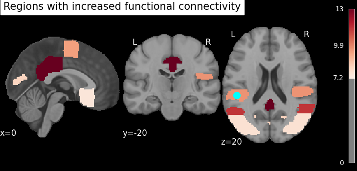

# Ketamine Connectome Analysis: Mapping Functional Connectivity in Depression

## Project Overview
This research project investigates the neurobiological mechanisms of **ketamine** as a rapid-acting antidepressant. Using **pharmacological fMRI (pharmaco-fMRI)** and **Graph Theory**, I analyze how ketamine reconfigures the brain's functional architecture in patients with Major Depressive Disorder (MDD).

The project identifies topological biomarkers within the **Default Mode Network (DMN)**, providing data-driven insights into how ketamine therapy may alleviate symptoms like rumination.

## Key Findings: Spatial Brain Mapping
The final analysis projected connectivity change scores onto an anatomical template. The map below highlights the cortical regions with the most significant increases in functional integration.

*Cortical projection showing the "hubs of change" after ketamine administration (Harvard-Oxford Atlas).*

## Project Structure
- `01_dataset_overview.ipynb`: Clinical metadata analysis (MADRS/HAMD scales).
- `02_subject_selection_and_fmri_loading.ipynb`: fMRI signal extraction and matrix construction.
- `03_graph_analysis.ipynb`: Calculation of network metrics (Node Strength) using `NetworkX`.
- `04_connectivity_visualization.ipynb`: brain mapping and final results.

## Identified Key Structures
Based on the graph analysis, the top 6 regions involved in connectivity shifts are:
1. **Posterior Cingulate Gyrus:** Central hub of the DMN; linked to the cessation of rumination.
2. **Middle Temporal Gyrus:** Associated with social and emotional processing.
3. **Angular Gyrus:** Key for self-referential processing.
4. **Inferior Temporal Gyrus:** High-level visual and semantic integration.
5. **Parietal Opercular Cortex:** Involved in somatosensory and pain processing.
6. **Juxtapositional Lobule (SMA):** Linked to motor initiation and energy recovery.

## Conclusions
The results demonstrate that ketamine induces a rapid reconfiguration of the functional connectome. Specifically, the modulation of **DMN hubs (like the PCC)** suggests a neurobiological basis for the cessation of depressive rumination. These findings support the use of graph-based fMRI analysis as a tool for evaluating the efficacy of novel psychiatric treatments.

## Technical Stack
- **Neuroscience:** `Nilearn`, `Harvard-Oxford Atlas`
- **Graph Theory:** `NetworkX`
- **Data Science:** `Pandas`, `NumPy`
- **Visualization:** `Matplotlib`, `Seaborn`

## Data Source
The raw fMRI and clinical data are sourced from **OpenNeuro** ([Dataset ds005917](https://openneuro.org/datasets/ds005917/versions/1.0.1)). 
*Note: Raw .nii.gz files are excluded from this repository via .gitignore due to size limits.*
